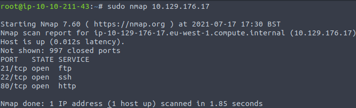

 <h1>Hack The Box - Cap Challenge</h1>

<h2>Hello 😍</h2>

<h3>I hope you are fine 😁</h3>

<h3>Cap Challenge</h3>

<h1>Instructions</h1>

  <h1>Level 1 - User_Own(user.txt)</h1>

<ol>

  <h2><li>Chapter 1 - Ping</li></h2>
 https://user-images.githubusercontent.com/83054516/126339063-c4e3e8ab-044c-4602-b16d-03ae17f316f2.png
  
  <h2><li>Chapter 2 - Nmap</li></h2>
  
  <h2><li>Chapter 3 - Open The Website</li></h2>
  <video src="https://user-images.githubusercontent.com/83054516/126337643-a631fe6d-f604-435b-9c0f-def73c0626b8.mov"></video>
  <h2><li>Chapter 4 - Open The pcap File in wireshark Tool</li></h2>
  <h2><li>Chapter 5 - use ftp Filter in WireShark</li></h2>
  
  <h3>
Username: nathan

    
Password: .......
</h3>
  
  <h2><li>Chapter 6 - Open nathan@[IP] with ftp</li></h2>
  <h2><li>Chapter 7 - ls</li></h2>
  <h2><li>Chapter 8 - show The Flag in user.txt</li></h2>
  <h3>Chapter 9 - Completed The Level 1 😍 🥳 💪</h3>
  </ol>

  

  <h1>Level 2 - System_Own(root.txt)</h1>
  <ol>
  <h2><li>Chapter 1 - Exit & Open nathan@[IP] with ssh</li></h2>
  <h2><li>Chapter 2 - use OS Library with Python Programming Language</li></h2>
  <h2><li>Chapter 3 - cd /root</li></h2>
  <h2><li>Chapter 4 - show The Flag in root.txt</li></h2>
  
  
 <h1>Congratulations 😍 🤩 🥳 💪</h2> 

  </ol>
